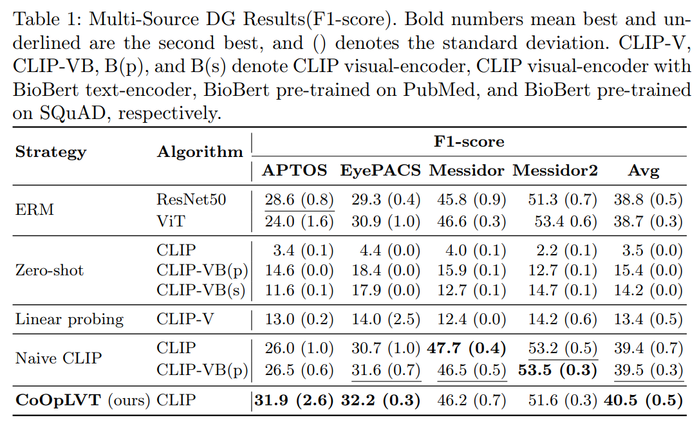
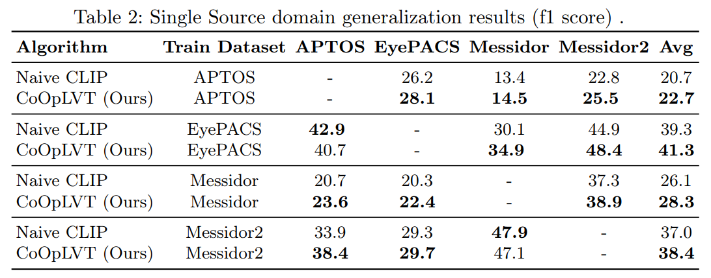

# Exploring the Transfer Learning Capabilities of CLIP on Domain Generalization for Diabetic Retinopathy

**CoOpLVT: Context Optimization with Learnable Visual Tokens**


## Abstract

Diabetic Retinopathy (DR), a leading cause of vision impairment, requires early detection and treatment. Developing robust AI models for DR classification holds substantial potential, but a key challenge is ensuring their generalization in unfamiliar domains with varying data distributions. To address this, our paper investigates cross-domain generalization, also known as domain generalization (DG), within the context of DR classification. DG, a challenging problem in the medical domain, is complicated by the difficulty of gathering labeled data across different domains, such as patient demographics and disease stages. Some recent studies have shown the effectiveness of using CLIP to handle the DG problem in natural images. In this study, we investigate CLIP’s transfer learning capabilities and its potential for cross-domain generalization in diabetic retinopathy (DR) classification. We carry out comprehensive experiments to assess the efficacy and potential of CLIP in addressing DG for DR classification. Further, we introduce a multi-modal finetuning strategy named Context Optimization with Learnable Visual Tokens (CoOpLVT), which enhances context optimization by conditioning on visual features. Our findings demonstrate that the proposed method increases the F1-score by 1.8% over the baseline, thus underlining its promise for effective DG in DR classification. Our code is publicly available at https://github.com/Sanoojan/CLIP-DRDG

## Results





## Install Dependencies

Run the following command to install the required conda environment and dependencies:
```bash
conda env create --file=environment.yml
```

## Download Dataset

Download the Dataset from [APTOS](https://www.kaggle.com/c/aptos2019-blindness-detection), [EyePACS](https://www.kaggle.com/datasets/mariaherrerot/eyepacspreprocess), [Messidor](https://www.adcis.net/en/third-party/messidor/), and [Messidor-2](https://www.adcis.net/en/third-party/messidor2/). Create the data directory structure like this,
'''
├── DATASET_PATH
│   ├── DR
│   │   ├── APTOS
│   │   ├── EyePACS
|   |   ├── Messidor
|   |   ├── Messidor2

'''

## Download Pre-trained Weights

The pre-trained weights can be accessed [here](https://drive.google.com/drive/folders/1w9gG3clV3ZlmhIT88n0QFNM29_rOou8Y?usp=sharing).

## CoOpLVT Algorithm Implementation

We implement our proposed **CoOpLVT** algorithm as a class in `domainbed/algorithms.py`:

```python
class Clip_train_prompt_from_image_v2(Algorithm):
    """
    CoOpLVT: Context Optimization with Learnable Visual Tokens
    """
    
    def __init__(self, input_shape, num_classes, num_domains, hparams, weights_for_balance):
       ...
```

## How To Use

There are two important scripts to run the training and evaluate the results: `run_train.sh` & `run_evaluation.sh`. By default, we run our experiments for 3 trials and then report the mean and standard deviation of the results. `run_train.sh` will perform a training process and `run_evaluation.sh` will give accuracy and f1-score from the experiment. In addition, we provide a sample output folder (`COOPLVT_TRAINING_LOGS`). In the actual output folder, best models are monitored and saved.

`run_train.sh`
``` bash
#!/bin/bash

nvidia-smi

for lr in  0.000005 
do
    for dataset in DR
    do
        for init in clip_full
        do
            for command in delete_incomplete launch
            do
                CUDA_VISIBLE_DEVICES=1,2,3,4,8,15 python -m domainbed.scripts.sweep $command\
                    --data_dir=DATASET_PATH \
                    --output_dir=COOPLVT_TRAINING_LOGS \
                    --command_launcher multi_gpu\
                    --algorithms Clip_train_prompt_from_image_v2 \
                    --single_test_envs \
                    --datasets ${dataset} \
                    --n_hparams 1  \
                    --n_trials 3 \
                    --hparams """{\"weight_init\":\"${init}\",\"backbone\":\"ClipBase\",\"lr\":${lr}}"""\
                    --skip_confirmation
            done > Outs/V23_CLIP_COOP_3_LAYERS_MLP.out
        done
    done
done

# CUDA_VISIBLE_DEVICES --> Denotes the GPUs indexes that we use to run the experiment.
# --data_dir           --> Dataset path.
# --output_dir         --> The path where the experiment outputs are saved in.
# --algorithms         --> The algorithm class that we want to use. See domainbed/algorithms.py to find algorithm variants. CoOpLVT is implemented as Clip_train_prompt_from_image_v2 class.
# --n_trials           --> Denotes how many trials that we want to run the experiment. By default, we set n_trials as 3 to alleviate randomness during training, allowing us to better interprete our experiments.
# Outs/V23_CLIP_COOP_3_LAYERS_MLP.out --> If we want to store terminal outputs.
```

`run_evaluation.sh`
``` bash
python -m domainbed.scripts.collect_results --input_dir COOPLVT_TRAINING_LOGS

# --input_dir --> The path where the experiment outputs are saved in.

# Sample output

# -------- Dataset: DR, model selection method: training-domain validation set
# Algorithm             aptos                 eyepacs               messidor              messidor_2            Avg                  
# Clip_train_prompt_fr  46.2 +/- 4.4          65.9 +/- 2.0          65.5 +/- 0.4          70.6 +/- 0.6          62.1                 

# -------- Averages, model selection method: training-domain validation set
# Algorithm                  DR                         Avg                       
# Clip_train_prompt_from_im  62.1 +/- 1.4               62.1                      

# -------- Dataset: DR, model selection method: training-domain validation set
# Algorithm             aptos                 eyepacs               messidor              messidor_2            Avg                  
# Clip_train_prompt_fr  31.9 +/- 2.6          32.2 +/- 0.3          46.2 +/- 0.7          51.6 +/- 0.3          40.5                 

# -------- Averages, model selection method: training-domain validation set
# Algorithm                  DR                         Avg                       
# Clip_train_prompt_from_im  40.5 +/- 0.5               40.5
```


## Acknowledgment

The code is build on the top of DomainBed: a PyTorch suite containing benchmark datasets and algorithms for domain generalization, as introduced in [In Search of Lost Domain Generalization](https://github.com/facebookresearch/DomainBed). CLIP and ViT codes are based on [CLIP](https://github.com/openai/CLIP) and [Timm](https://github.com/huggingface/pytorch-image-models/tree/main/timm) respectively. We thank the authors for releasing their code publicly.

## Licence
This source code is released under the MIT license, included [here](./LICENSE)
